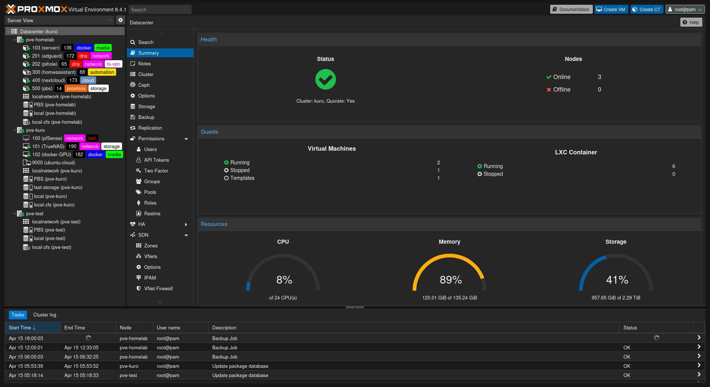
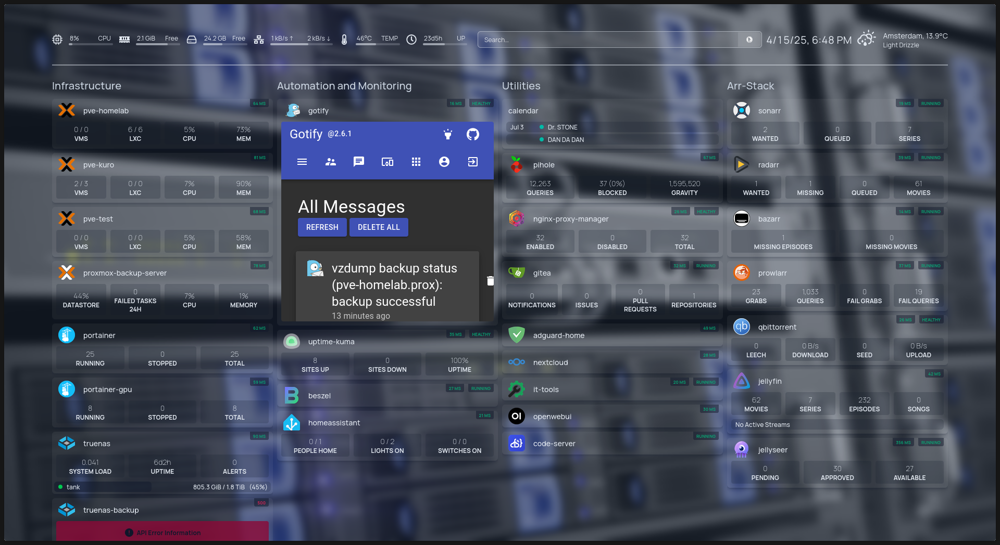

---

## 📚 Latest Posts

  <h3><a href="posts/post-02-ufw-role"> 🔧 ufw-role</a></h3>
  
Ansible role for setting up UFW, SSH key access, and automation security best practices.

  <h3><a href="posts/post-03-dotfile-mgmnt"> 💾 Dotfiles Setup</a></h3>
  
How I bootstrap a fresh machine with my dotfiles and Git configuration.

  <h3><a href="posts/post-01-figurine-install"> 🤖 Figurine Setup</a></h3>
  
Add fun ASCII banners to your terminal using <code>figurine</code>.

---

# **Homelab** :house: :test_tube:

Self-documentation repo for my own sake along the journey of setting up a nice homelab.

<!-- more -->

## :clipboard: Introduction

First of all, I have to say that I am not an expert in networking, containers, storage, Linux... so please be aware that everything you see here does not originate from me. It comes from many sources, including YouTube videos, forums, knowledgeable friends, and a general willingness to get things working.

This repo serves as a way for me to document the setup of my new homelab after having a functional setup for a couple of months, albeit not the most reliable. This includes how the services I use are configured and operated.

---

## :gear: Current Setup

- **Hardware**: A 3 node Proxmox Cluster, consisting on 2 minipc's, 1 of them only runs as quorum device, and the other one has my main and more lightwight services, both in Docker
and LXC containers, and lastly, and HP Z620 Workstation in which I am hosting an instance of TrueNAS Scale along with another docker instance where I am passing through the GPU. 
- **Storage**: 2TB mirror VDEV (hoping to upgrade very soon, but easy enough just by adding mirrors, since losing half of the capacity doesn't bother me too much).

---

## :chart_with_upwards_trend: Planned Services

Here’s a list of services I plan to run:

- **Media Management**:
  - Arr Stack (Sonarr, Radarr, etc.) via **Gluetun VPN** with **PIA**.
  - **Jellyfin** and **Jellyseer** for media consumption.

- **Utilities**:
  - **Pi-hole** for network-wide ad-blocking and DNS management.
  - **Portainer** to simplify container management.
  - **Photo backup software**, such as **Nextcloud**.
  - A dashboard like **Homepage** for centralized management.

---

## :construction: Key Considerations

1. **Local Access Only**:  
   All services will be accessible **only inside my house** theoritetically, I have a Tailnet and many connectors in various machines (virtual or physical) so I don't need
   to open any ports to the public internet.

2. **Local SSL certificates**:  
   I have an instance of **NPM** that I use along with **pihole** to be able to add the custom DNS records to the proxys served by **NPM**

3. **Storage Integration**:  
   I know that having a virtualized TrueNAS is not recommended, but since the machine where I am hosting has so many resources I didn't  want to limit the capabilities of the machine
   in the sense of upgradability, so instead of having to virtualized something inside TrueNAS, I rather have the virtualized nas and also be able to host couple of things more.  

---

## :white_check_mark: Conclusion

This repo is a work in progress as I rebuild my homelab. It’s a learning process, and I hope documenting it helps me (and potentially others) along the way.

---