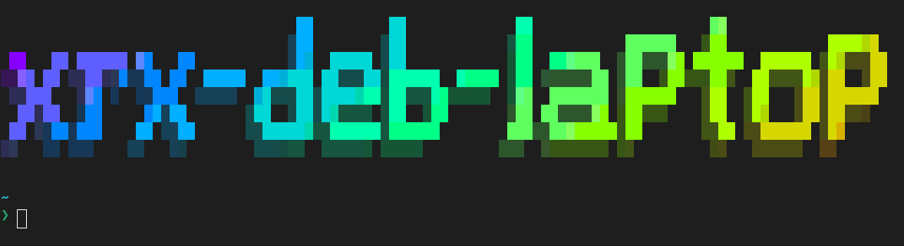

---
date:
    created: 2025-04-16
tags:
    - customization
    - shell
    - linux
slug: figurine-install

---

# **Figurine, display your hostname in style :sunglasses:**

Learn how to display a colorful and 3d looking custom text on your shell start screen.



<!-- more -->

# Installing and Configuring Figurine

## Step :one: : Download and Install Figurine &nbsp;:arrow_down: :gear:

```bash title="Download binary and move to /usr/local/bin" linenums="1"
wget https://github.com/arsham/figurine/releases/download/v1.3.0/figurine_linux_amd64_v1.3.0.tar.gz -O deploy.tar.gz
tar -xvf deploy.tar.gz
sudo mv deploy/figurine /usr/local/bin
```

## Step :two: : Test Figurine Installation &nbsp;:test_tube: :gear:

```bash title="Run this command to preview" linenums="1"
figurine -f "3d.flf" `hostname`
```

## Step :three: : Create the Profile Script &nbsp;:scroll:

```bash title="Create file" linenums="1"
sudo nano /etc/profile.d/figurine.sh
```

Add the following lines to the file:

```bash title="Change hostname to whatever text you prefer" linenums="1"
echo ""
figurine -f "3d.flf" `hostname`
echo ""
```

## Step :four: : Test the Script &nbsp;:test_tube: :scroll:

```bash title="Check if its working" linenums="1"
sh /etc/profile.d/figurine.sh
```

## Step :five: : Exit and log back in &nbsp;:outbox_tray: :inbox_tray:

Once the file is created, exit your session and login locally or through SSH back in to test it.

## Step :six: : Clean Up &nbsp;:broom:

```bash title="Remove leftover files" linenums="1"
rm -rf deploy*
```
